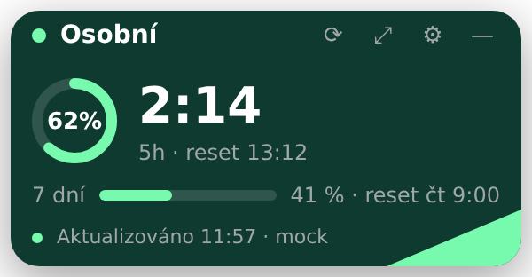
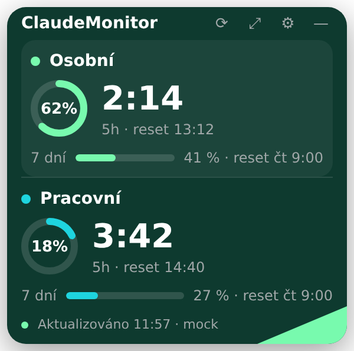

# ClaudeMonitor

Malý widget pro Windows plochu, který hlídá vyčerpání Claude účtů a hlavně to,
**kdy se limity zase obnoví**. Zvládá víc účtů najednou (soukromý + pracovní),
běží v system trayi a vzhledem se drží design systému ŠKODA Flow.




## Co ukazuje

- **odpočet do resetu 5hodinového okna** — největší prvek v celém widgetu,
  plus absolutní čas („reset 13:12"),
- vyčerpání 5h okna v procentech (prstenec) a týdenního limitu (bar),
- v rozšířeném zobrazení navíc rozpad Opus/Sonnet, extra kredity a lokální
  odhad spotřeby tokenů a nákladů za aktuální blok,
- notifikaci při 80 % a 95 % a při obnovení limitu.

Dokud je připojený jeden účet, widget je jednoúčtový. Po přidání druhého se
sám přepne do vícepanelového rozvržení a účet s nejbližším resetem zvýrazní.

## Odkud bere data

Widget **nezavádí žádné nové přihlašování.** Půjčí si OAuth token, který už na
disku má Claude Code, a zeptá se stejného endpointu, jaký používá příkaz
`/usage`:

```
GET https://api.anthropic.com/api/oauth/usage
```

Když endpoint není dostupný (vypršelý token, výpadek sítě, 429), spadne widget
na **lokální odhad** z transcriptů Claude Code (`<configDir>/projects/**/*.jsonl`).
Ten spolehlivě dá hranici 5hodinového bloku a objem tokenů; procento vyčerpání
z něj odvodit nejde (limit je účtový a zahrnuje i claude.ai web), takže se
takové číslo vždy označí jako odhad — nebo se neukáže vůbec.

## Instalace

Zatím není publikovaný žádný release — instaluje se sestavením ze zdrojáků
na Windows stroji. Potřebuješ **Node.js 22.12+** a git.

### 0. Node.js bez práv správce

Ověř, jestli ho už nemáš:

```powershell
where.exe node ; where.exe npm
```

Když `npm` není k nalezení, rozbal si Node portable do svého profilu —
žádný instalátor, žádná práva správce:

```powershell
$dist = "https://nodejs.org/dist/latest-v22.x/"

# Název souboru se čte ze SHASUMS256.txt, ne z HTML výpisu adresáře —
# ten se za firemní proxy často vrátí přepsaný a parsování odkazů selže.
$sums = (Invoke-WebRequest -UseBasicParsing ($dist + "SHASUMS256.txt")).Content
$file = [regex]::Match($sums, 'node-v22\.[\d.]+-win-x64\.zip').Value
if (-not $file) { throw "Nepodařilo se zjistit název archivu. Vypiš `$sums a podívej se, co server vrátil." }
"Stahuji $file"

$zip = "$env:USERPROFILE\Downloads\$file"
Invoke-WebRequest -UseBasicParsing ($dist + $file) -OutFile $zip
Expand-Archive $zip -DestinationPath "$env:LOCALAPPDATA\node" -Force

$nodeDir = (Get-ChildItem "$env:LOCALAPPDATA\node" -Directory | Select-Object -First 1).FullName
if (-not $nodeDir) { throw "Rozbalení neproběhlo — zkontroluj $env:LOCALAPPDATA\node." }
$env:Path = "$nodeDir;$env:Path"
node -v ; npm -v
```

Aby PATH přežil restart konzole (zapisuje se do uživatelské větve registru,
nic systémového):

```powershell
[Environment]::SetEnvironmentVariable(
  "Path", "$nodeDir;" + [Environment]::GetEnvironmentVariable("Path","User"), "User")
```

`Invoke-WebRequest` používá systémové úložiště certifikátů Windows, takže
za Zscalerem funguje bez konfigurace.

### 1. Získej kód

```powershell
git clone --single-branch -b claude/claude-credit-monitor-dashboard-vjmzxk `
  https://github.com/PetrMB/camper-drift ClaudeMonitor
cd ClaudeMonitor
```

`--single-branch` je podstatné: větev má vlastní kořen historie, takže se
naklonuje jen ClaudeMonitor, nic jiného z toho repozitáře.

### 2. Nainstaluj závislosti

```powershell
npm install
```

> **V korporátní síti pozor:** `npm install` a stahování binárky Electronu jedou
> přes **Node**, ne přes Chromium — takže na ně `NODE_EXTRA_CA_CERTS` **vliv má**
> (na běh samotné aplikace ne, viz sekce o Zscaleru níž). Když instalace spadne
> na certifikátu nebo proxy:
>
> ```powershell
> $env:NODE_EXTRA_CA_CERTS = "C:\cesta\k\zscaler-root.pem"   # stejný PEM jako pro Claude Code
> $env:ELECTRON_GET_USE_PROXY = "true"
> $env:GLOBAL_AGENT_HTTPS_PROXY = $env:HTTPS_PROXY
> npm install
> ```
>
> Nikdy nevypínej `strict-ssl` v npm — správná cesta je doplnit CA.

### 3. Ověř prostředí, než něco sestavíš

```powershell
npm run probe
```

Udělá **jeden** headless dotaz na API a vypíše stav credentials, použitý
User-Agent, HTTP status, rozparsovanou odpověď a zvolený režim certifikátů.
Token nikdy nevypisuje. Tímhle si potvrdíš, že Zscaler, User-Agent i beta
hlavička fungují — teprve pak má smysl řešit zbytek.

Když probe projde, můžeš si widget rovnou pustit bez instalace:

```powershell
npm run dev
```

### 4. Sestav instalátor

```powershell
npm run release:win
```

Ve složce `release\` vzniknou dva soubory:

- **`ClaudeMonitor-0.1.0-setup.exe`** — doporučeno. Instaluje se do
  `%LOCALAPPDATA%\Programs\ClaudeMonitor`, **nevyžaduje práva správce**, a založí
  zástupce ve Start menu, což je na Windows podmínka pro funkční toast notifikace.
- **`ClaudeMonitor-0.1.0-portable.exe`** — spustí se odkudkoli bez instalace.
  Notifikace v tomhle režimu chodí přes tray balloon místo systémových toastů.

Aplikace není podepsaná certifikátem, takže při prvním spuštění vyskočí
SmartScreen → *Další informace* → *Přesto spustit*. (Podepsat ji vlastním
self-signed certifikátem by varování jen zhoršilo.)

### 5. První spuštění

Widget si sám najde `%USERPROFILE%\.claude`, založí z něj účet a naskočí
v pravém horním rohu plochy. Přetáhni ho, kam chceš — pozici si pamatuje.
Autostart zapneš v menu tray ikony („Spouštět s Windows", zapisuje do `HKCU`,
bez práv správce). Druhý účet přidáš podle sekce níž.

## Dva účty

Claude Code drží konfiguraci ve složce dané proměnnou `CLAUDE_CONFIG_DIR`,
ve výchozím stavu `%USERPROFILE%\.claude`. Druhý účet si zřídíš tak, že mu dáš
vlastní složku:

```powershell
# jednorázově pro pracovní účet
$env:CLAUDE_CONFIG_DIR = "$env:USERPROFILE\.claude-work"
claude          # přihlas se pracovním účtem

# trvale
setx CLAUDE_CONFIG_DIR "$env:USERPROFILE\.claude-work"
```

ClaudeMonitor pak druhou složku najde sám (prochází `~/.claude*`) a v nastavení
ji nabídne jedním kliknutím. Jde ji taky vybrat ručně.

## Zscaler a firemní certifikáty

Dotaz na API jde přes síťový stack Chromia, který na Windows používá
**systémové úložiště certifikátů** — tam, kam firemní IT Zscaler root už
nainstalovalo. V drtivé většině případů tedy není co nastavovat.

> `NODE_EXTRA_CA_CERTS` je mechanismus Node `tls` a na tuhle cestu **nemá vliv**.
> Přesně proto widget používá Electron `net` a ne `https`/`undici`.

Kdyby dotaz přesto padal na certifikátu, vyplň v nastavení cestu k PEM souboru
(ten, co používáš pro Claude Code) — widget si z něj vezme fingerprinty a přijme
je **jen pro `api.anthropic.com`**. Ověřování certifikátů se nikdy nevypíná.

Poslední záchrana pro striktní prostředí: v nastavení lze zapnout
**„Jen lokální data"** — pak widget neudělá jediný síťový požadavek.

## Co dělá s tokenem (a co ne)

- Soubor `.credentials.json` se otevírá **výhradně pro čtení**. Widget do žádné
  konfigurační složky Claude Code nezapisuje a **neprovádí refresh tokenu** —
  refresh tokeny rotují a zápis by rozbil tvoje přihlášení v Claude Code.
  Když token vyprchá, widget to napíše a počká, až ho Claude Code sám obnoví
  (změnu souboru hlídá a hned se probere).
- Token žije jen jako lokální proměnná v hlavním procesu. Neukládá se, neloguje
  se (logger redaguje každý řádek) a **do okna aplikace se nikdy nedostane** —
  renderer vidí jen odvozená čísla a časy.
- Žádná telemetrie, žádný auto-update server, jediný host, na který se volá,
  je `api.anthropic.com`.

Tahle pravidla nejsou jen slib — vynucují je testy v `test/guards.test.ts`
(zákaz zápisových fs volání nad `configDir`, zákaz `ignore-certificate-errors`,
kontrola redakce tokenu).

## Vývoj

```bash
npm install
npm run dev              # živý widget
npm run dev:mock         # mock data, bez účtu a bez sítě
npm test                 # unit testy
npm run typecheck
npm run release:win      # portable + NSIS build
```

### Probe — ověření prostředí bez UI

Než se cokoli postaví nad API, ověř si jedním během, že projde Zscaler,
User-Agent i beta hlavička:

```bash
npm run probe
```

Vypíše stav credentials, použitý User-Agent, HTTP status, rozparsovanou odpověď
a zvolený režim certifikátů. Token nikdy nevypisuje.

### Mock scénáře

```bash
CLAUDEMONITOR_MOCK=1 CLAUDEMONITOR_MOCK_SCENARIO=critical npm run dev
```

Dostupné: `normal`, `near-limit`, `critical`, `reset-soon` (reset za 73 s, dá se
tak odzkoušet notifikace o obnovení), `expired-token`, `rate-limited`, `offline`,
`dual-account`, `extra-usage`, `weird-shape` (simuluje změnu tvaru API).

`CLAUDEMONITOR_MOCK_CLOCK=<iso>` zmrazí čas — v kódu se `Date.now()` mimo
`src/shared/time.ts` nepoužívá, takže jsou testy i screenshoty deterministické.

### Náhledy designu

```bash
npx electron-vite build && node build/preview.mjs
```

Vyrenderuje widget do PNG přes Chromium bez Electronu.

### Ikony

```bash
node build/make-icons.mjs
```

Generuje `.ico` pro aplikaci a čtyři stavy trayi přímo z barev ŠKODA CI.

## Design

Widget se drží ŠKODA Flow / CI tokenů (`src/renderer/styles/tokens.css`):
Emerald Green `#0E3A2F` jako plocha, Electric Green `#78FAAE` jako akcent,
jeden plochý facet pod úhlem ~22°, sentence case, zarovnání vlevo.
Terciární barvy (oranžová, červená) se používají bodově a **vždy jen jedna
naráz** — sjednocuje je `pickComposition()` v `src/renderer/state.ts`.

Font **SKODA Next** je licencovaný a v repozitáři není. Pokud ho máš, ukaž
v nastavení na složku s `.woff2` soubory. Bez něj widget použije Segoe UI
a layout je na to připravený.

## Známá rizika

| Riziko | Jak je ošetřené |
|---|---|
| `/api/oauth/usage` je nedokumentovaný a může se změnit | Tolerantní parser, který nikdy nevyhodí výjimku a hlásí neznámé klíče; automatický pád na lokální odhad |
| 429 rate limit | Povinná `User-Agent: claude-code/*`, interval ≥ 180 s, rozprostření dotazů mezi účty, exponenciální backoff, single-instance lock. Souběžný běh `ccusage` sdílí stejný token a může 429 vyvolat |
| Firemní politika ke čtení credentials | Jen čtení, nulová persistence, plně lokální režim jako alternativa |

## Licence

MIT — viz [LICENSE](LICENSE) a [NOTICE](NOTICE).
