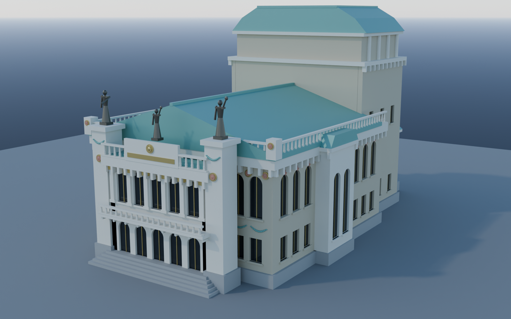

# 🎭 Městské divadlo Mladá Boleslav — model pro Blender

Parametrický model secesní budovy divadla v Palackého ulici v Mladé Boleslavi,
generovaný skriptem `divadlo_mlada_boleslav.py`.



## Předloha

Budova byla postavena v letech **1906–1909** podle návrhu architektů
**Jana Kříženeckého a Emila Králíka**; interiér v neobarokním duchu navrhla
vídeňská firma **Fellner & Helmer**. Základní kámen byl položen 12. listopadu
1906, provoz zahájila 21. listopadu 1909 Jiráskova *Lucerna*. Hlediště má dnes
kapacitu 395 míst.

Model přebírá tyto doložené architektonické znaky:

| Znak předlohy | V modelu |
|---|---|
| jednoduchá obdélná dispozice | hlavní hmota 24 × 26 m |
| vstupní rizalit | `Rizalit*`, 13,2 m široký, 5 os |
| rizality schodišť v postranních fasádách | `Schodiste_Zapad/Vychod` |
| přístavba při zadní části budovy | `Pristavba_*` |
| sedlová střecha | `Strecha_sedlova` |
| mansardová střecha nad provazištěm | `Strecha_mansardova` |
| dvoupatrová nástavba s okny a sloupy nad jevištěm | `Nastavba_jadro`, `Sloup_nastavba_*` |
| výrazná konzolová římsa | `Rimsa_hlavni` s řadou konzol |
| balustrádová atika s nárožními maskami | `Atika_*`, `Maska_narozi*` |
| dva pylony se sochami Jana Štursy | `Pylon_Probuzeni_naroda`, `Pylon_Vitezstvi_umeni` |
| keramické maskarony druhů dramatického umění | `Maska_celo*`, `Terc_*` |
| měděné věnce a festony, monogram | `Feston_*`, `Monogram_MD` |
| socha Thálie, heslo „Umění — síla života“ | `Thalie`, `Napisove_pole`, `Heslo_*` |

> **Model je stylizovaný.** Vychází z popisu a proporcí památky, ne
> z geodetického zaměření ani z výkresové dokumentace. Sochařská výzdoba je
> záměrně zjednodušená na čitelné hmoty; nejde o rekonstrukci Štursových děl.

## Co skript vyrobí

Do adresáře `out/`:

| Soubor | Obsah |
|---|---|
| `divadlo_mlada_boleslav.blend` | scéna s modelem, materiály, sluncem a třemi kamerami |
| `divadlo_mlada_boleslav.glb` | model pro web / three.js / import jinam |
| `nahled_01_nadhled.png` | nárožní pohled |
| `nahled_02_pruceli.png` | čelní pohled na hlavní průčelí |
| `nahled_03_bok.png` | boční pohled s jevištní částí |

Rozsah: **461 objektů, ~18 400 polygonů** — dost hrubé na to, aby se dalo
otáčet v reálném čase, dost jemné na to, aby fasáda četla.

## Spuštění

S nainstalovaným Blenderem:

```bash
blender --background --python divadlo_mlada_boleslav.py
```

Nebo bez Blenderu, jen s pip modulem `bpy` (vyžaduje Python 3.11):

```bash
pip install bpy
python3 divadlo_mlada_boleslav.py
```

Přepínače (přes `blender` je uveď za `--`):

```
--no-render     jen postaví a vyexportuje model, nerenderuje
--quick         rychlé náhledy v nízkém rozlišení (1000×620, 32 vzorků)
--samples N     počet vzorků Cycles (výchozí 96)
```

Renderuje se v **Cycles na CPU**, takže to jede i bez grafické karty —
plné náhledy trvají na 4 jádrech kolem 9 minut, `--quick` kolem 4.

## Jak je to postavené

Souřadnice v **metrech**, osa **Z nahoru**, hlavní **průčelí míří k −Y**.
Všechny rozměry jsou pojmenované konstanty v hlavičce skriptu, takže se dají
přeladit proporce bez zásahu do geometrie.

Klíčové stavební kameny:

* **`Facade`** — stěna s okenními otvory. Otvory se **neřežou booleany**;
  stěna se skládá z parapetních pásů, meziokenních pilířů a záklenkových
  nadpraží, takže díry jsou skutečné a síť zůstane čistá a bez n-gonových
  artefaktů. Půlkruhové záklenky jsou hladké (22 dílků), ne schodovité.
* **`prism`** — uzavřený 2D profil protažený podél osy; používá se na střechy
  a na zdivo nad záklenky.
* **`cornice`, `balustrade`, `pilaster`, `mascaron`, `festoon`, `statue`** —
  opakované architektonické prvky. Drobné díly se na konci slučují do objektů
  `Vyzdoba_detail`, `Strechy_krytina` a `Vstupni_schodiste`, aby outliner
  a export nebobtnaly.

Objekty jsou v kolekcích `Hmota`, `Průčelí`, `Střechy`, `Výzdoba`, `Sochy`,
`Prostředí` a zavěšené pod prázdným objektem `DIVADLO_MLADA_BOLESLAV`.

### Na co si dát pozor při úpravách

Dvě **splývající vnější plochy** (dva kvádry se stejným lícem) se v Cycles
navzájem stíní a plocha se vyrenderuje **černá**. Proto:

* jádrové hmoty (`Provaziste_jadro`, `Pristavba_jadro`) se o 2 cm zanořují pod
  líc fasádních stěn,
* čelní a zadní stěny končí až v líci stěn bočních (`±(MAIN_X − WALL_T)`),
  rohy uzavírají boční stěny,
* sokly na sebe nenavazují s překryvem.

Expozice je odměřená, ne odhadnutá: sluneční kotouč v uzlu oblohy je vypnutý
(`sun_disc = False`), přímé světlo dělá samostatná lampa, jinak se scéna
osvětlí dvakrát a fasáda se přepálí do bílé.

## Zdroje

* [Městské divadlo Mladá Boleslav — Wikipedie](https://cs.wikipedia.org/wiki/M%C4%9Bstsk%C3%A9_divadlo_Mlad%C3%A1_Boleslav)
* [Databáze divadelní architektury — theatre-architecture.eu](https://www.theatre-architecture.eu/cs/db.html?theatreId=31)
* [O divadle — mdmb.cz](https://www.mdmb.cz/o-divadle/)
* [Městské divadlo v Mladé Boleslavi — Kudy z nudy](https://www.kudyznudy.cz/aktivity/mestske-divadlo-v-mlade-boleslavi)
